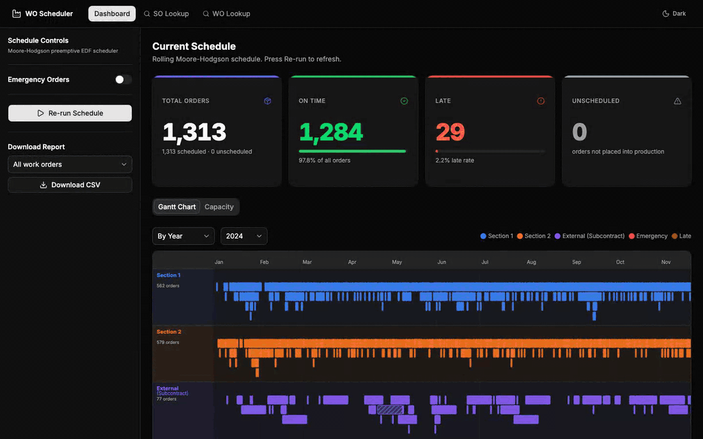
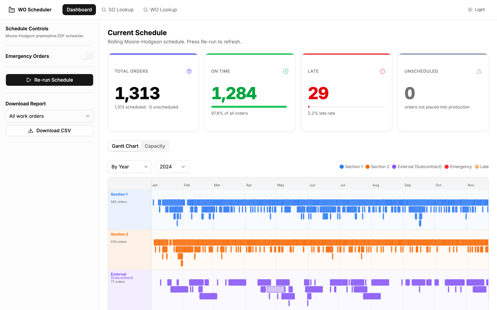
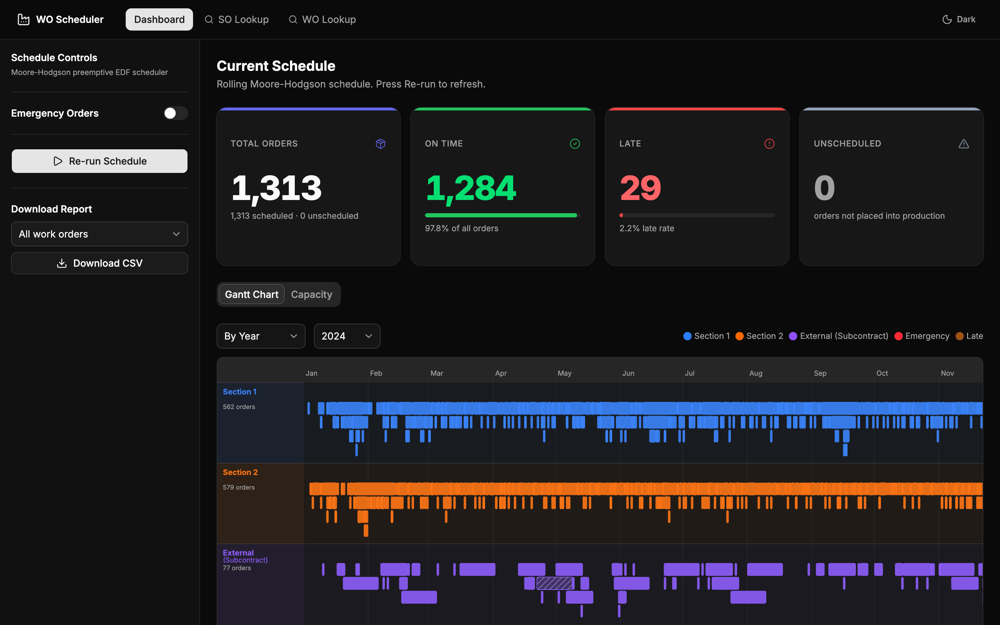
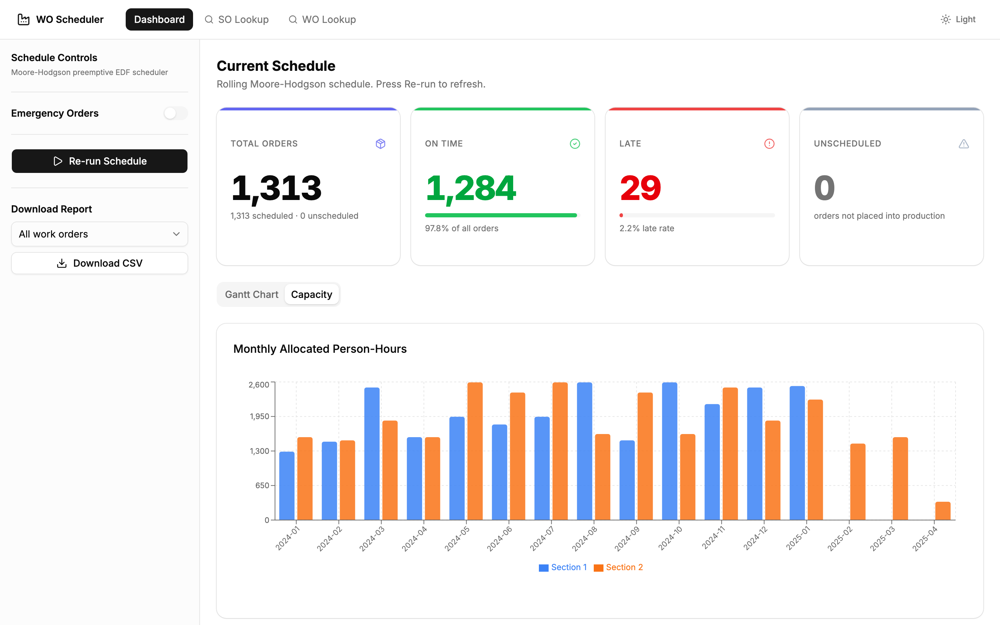
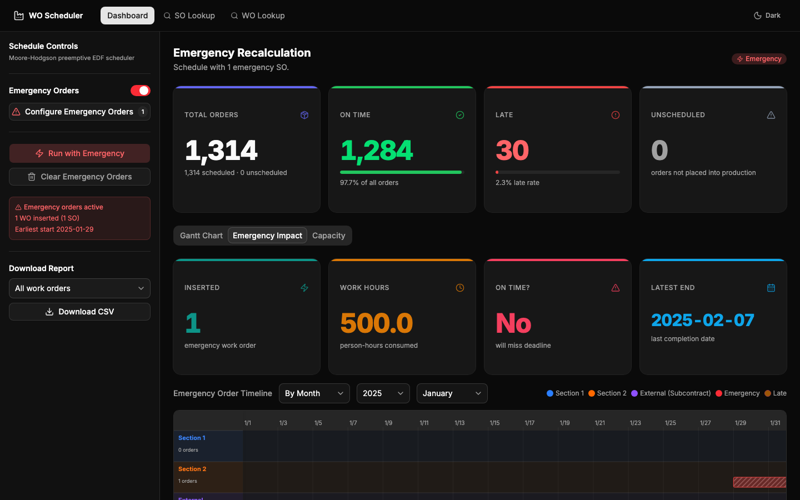
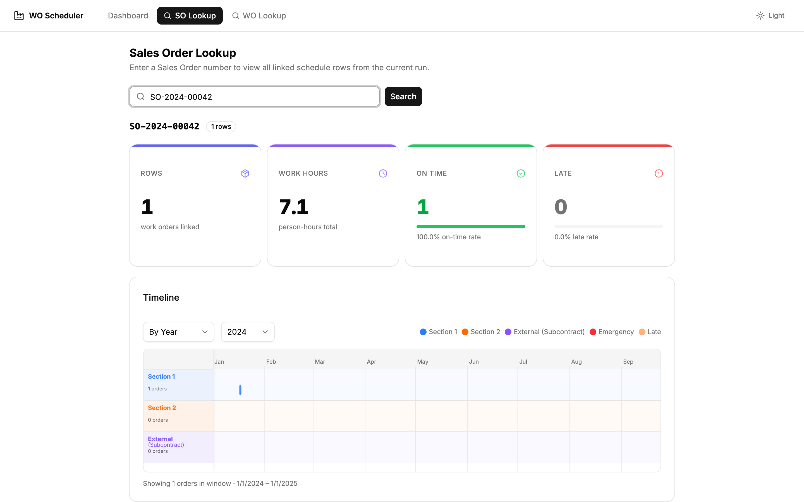
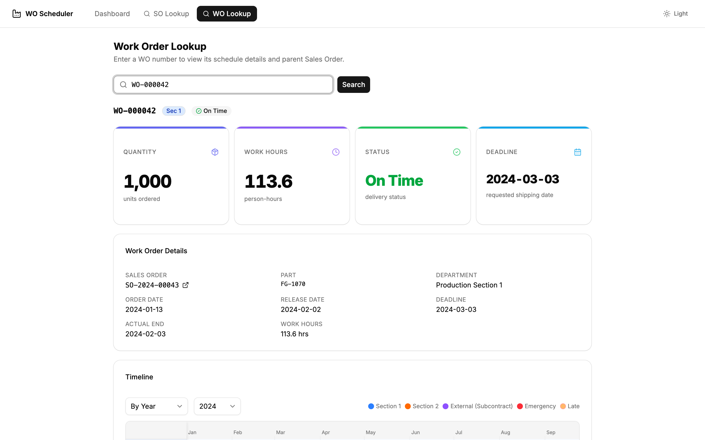

# Work Order Scheduler

Production-scheduling dashboard for a make-to-order manufacturer: turns sales orders, bills of materials and monthly headcount into a day-by-day work-order plan, predicts which orders will ship late, and lets planners insert rush orders and see the impact immediately.



> Built as a team project for an industry partner during the *Machine Learning and Big Data Analytics* course at NTUST (Taiwan), 2026. The partner's data is under NDA, so this repository ships **only synthetic data** generated by `scheduler/generate_data.py`.

## Screenshots

| Light | Dark |
|---|---|
|  |  |
|  |  |
|  |  |

## Run it

Requires [uv](https://docs.astral.sh/uv/) and [pnpm](https://pnpm.io/).

```bash
# 1. API (generates synthetic data on first start, then runs the schedule)
cd backend && uv sync && uv run uvicorn main:app --port 8000

# 2. Dashboard
cd frontend && pnpm install && pnpm dev   # http://localhost:5173
```

API docs are served at `http://localhost:8000/docs`.

## Structure

| Path | What it is |
|---|---|
| `frontend/` | React 19 + TypeScript + Vite dashboard (Tailwind, shadcn/ui, TanStack Query, Recharts, custom SVG Gantt chart) |
| `backend/` | FastAPI service wrapping the scheduler: run schedule, add/clear emergency orders, SO/WO lookup |
| `scheduler/` | Rolling preemptive Moore-Hodgson scheduler ([spec](scheduler/SCHEDULER.md)) and the synthetic data generator |

## Credits

Team of five. Dashboard, API and emergency-order support by Pablo Lird; scheduling algorithm by a teammate.
